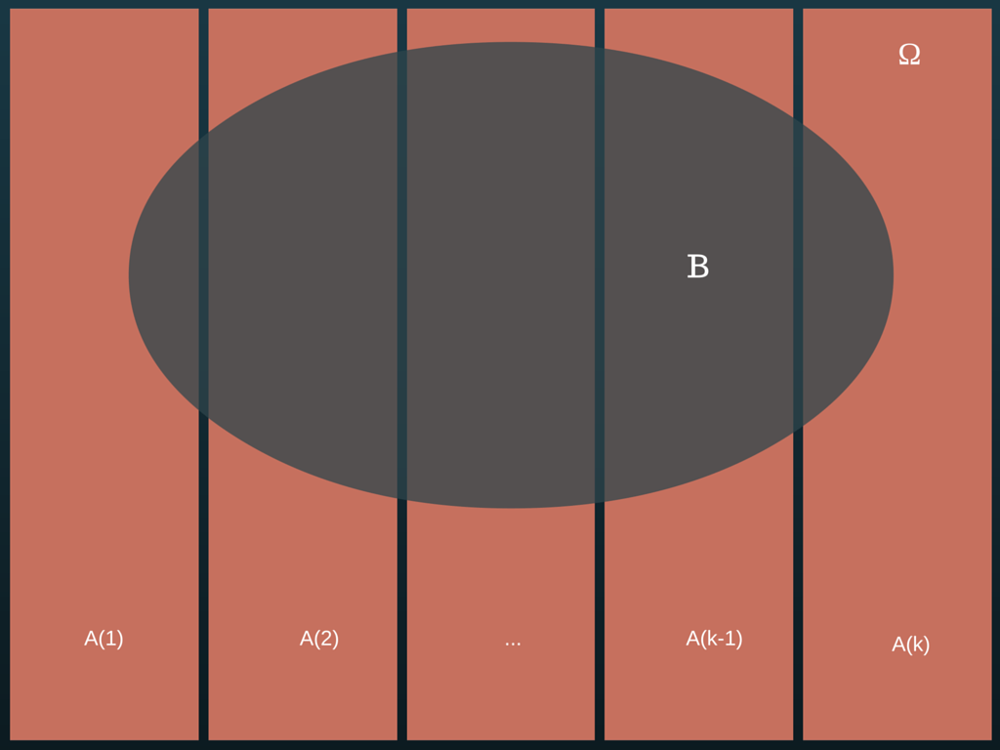

# Chapter 1; Probability and Distributions (continued)

## Probability theory basics (continued)

     ...intutitive and reasonable properties follow.  
     ...example last time, one more example to talk about:

> Example 2

     Suppose I have a tour guide collecting passports from tourists (maybe for registration).  
     Afterwards, passports randomly returned.  There are n  (eg. 6) tourists.  
     What is the probability that at least one tourist gets their own passport back.  
     The probability of a specific tourist getting their own passport back is small, but what about *any* tourist?

A tour guide collects passports from a group of n tourists for registration purposes.  When it's done the passports are randomly given back to the tourists.  What is the probability that one or more tourists gets their own passport back?  

For n = 3,

Tourists $T_1, T_2, T_3$

Passports $P_1, P_2, P_3$
     

$T_1$ | $T_2$ | $T_3$ | Number of tourists who get their own passport $\geq 1$
---|----|----|--
$P_1$ | $P_2$ | $P_3$ | $T$
$P_1$ | $P_3$ | $P_2$ | $T$
$P_2$ | $P_1$ | $P_3$ | $T$
$P_2$ | $P_3$ | $P_1$ | $F$
$P_3$ | $P_1$ | $P_2$ | $F$
$P_3$ | $P_2$ | $P_1$ | $T$

$P($At least one tourist gets their passport back$) = \frac{4}{6} = \frac{2}{3}$

For general n, one needs to use the inclusion-exclusion formula.

For n = 2, 

$P(A_1 \cup A_2) = P(A_1) + P(A_2) - P(A_1 \cap A_2)$

For n = 3,

$P(A_1 \cup A_2 \cup A_3) = P(A_1) + P(A_2) +P(A_3) - P(A_1 \cap A_2) - P(A_1 \cap A_3) - P(A_2 \cap A_3) + P(A_1 \cap A_2 \cap A_3)$

For arbitrary n,

$P(\displaystyle \bigcup_{i = 1}^{n}) = \displaystyle \sum_{i - 1}^{n} P(A_i) - \displaystyle \sum_{i < j} P(A_i \cap A_j) + \displaystyle \sum_{i < j < k} P(A_i \cap A_j \cap A_k) - \displaystyle \sum_{i < j < k < l} P(A_i \cap A_j \cap A_k \cap A_l) -$...

$A_i : T_i$ gets $P_i = 1 - \displaystyle \frac{1}{e}$ for large $n$

# 2. Conditional Probability & Independence

Let A be an event of interest.  

Instead of $P(A)$ we are sometimes interested in the probability of A when B has occurred.  

This is the conditional probability of A given B, defined as

$P(A|B) = \displaystyle \frac{P(A \cap B)}{P(B)}$, for $P(B) > 0$.

> Diagram 1

The $\frac{purple}{purple + blue}$ area is $P(A|B)$.

```{r Diagram 1, echo = FALSE, warning = FALSE, messages = FALSE}
#install.packages("VennDiagram")
library(grid)
library(futile.logger)
library(VennDiagram)
grid.newpage(); 
diagram.1 <- draw.triple.venn(area1 = 100, area2 = 40, area3 = 40, 
                              n12 = 40, n23 = 20, n13 = 40, n123 = 20, 
                              category = c("Omega", "B", "A"), 
                              cat.pos  = c(0, 40, 180), 
                              cat.dist = c(0.05, 0.05, 0.05), 
                              fill = c("grey", "blue", "red"), 
                              alpha = 0.3, 
                              lty = c(0,1,2), 
                              cex = 0, cat.cex  = 2, 
                              cat.col  = c("grey", "blue", "red"), 
                              col = c("grey", "blue", "red"))
grid.draw(diagram.1)
```

> Example 1

Roll two dice.  

A: sum is 7

B: 1st is 3

$P(A|B) = \displaystyle \frac{P(A \cap B)}{P(B)} = \displaystyle \frac{\frac{1}{36}}{\frac{6}{36}} = \frac{1}{6}$

Incidentally, $P(A) = \frac{6}{36} = \frac{1}{6}$

> Example 2

Two chips are randomly selected, one at a time, without replacement, from a bag containing three red chips and five blue chips.  

Let

$B:$ 1st is red

$A:$ 2nd is red

$P(A|B) = \displaystyle \frac{2}{7}$

From the definition, we have

$P(A \cap B) = P(A|B) * P(B) = P(B|A) * P(A)$

Let $A_1$, ..., $A_k$ be mutually exclusive and exhausting, i.e., $A_i \cap A_j = \emptyset$, for $i \neq j$, and $\displaystyle \sum_{i = 1}^{K}A_i = \Omega$

Then for $B$, we have 

$P(B) = P(B \cap \Omega) = P(B \cap (\displaystyle \bigcup_{i = 1}^{K} A_i)) = P(\displaystyle \bigcup_{i = 1}^{K}(B \cap A_i)) = \displaystyle \sum_{i = 1}^{K}P(B\cap A_i) = \displaystyle \sum_{i = 1}^{K}P(B|A_i) * P(A_i)$

> Aside:

$b(a_1 +$ ... $a_k) = ba_1 +$ ... $+ ba_k = b\sum_{i = 1}^{K} a_i = \sum_{i = 1}^{K} ba_i$

> Example 2 continued:

i.e.,

$P(B) = \displaystyle \sum_{i = 1}^{K} P(B|A_i) * P(A_i)$, 

known as the total probability formula.  

> Diagram 2

The whole box is $\Omega$, the red-ish boxes are $A_i$'s, the blue-ish oval is $B$.

If we add up the proportions of each $A_i$ that are covered by $B$, scaled for the proportion of $\Omega$ that each $A_i$ makes up, we get the proportion of $\Omega$ that $B$ makes up.




> Bayes' Theorem

One step further, we get $P(A_j|B) = \displaystyle \frac{P(A_j \cap B)}{P(B)} = \displaystyle \frac{P(B|A_j)P(A_j)}{\displaystyle \sum_{i = 1}^{K}P(B|A_i)P(A_i)}$, Bayes Theorem.  

     Helps establish cause and effect. 
     Useful in statistical inference (eg. Bayesian inference).  
     
> Example 3

Two urns:  

Urn 1: 2 red, 4 blue marbles

Urn 2: 3 red, 5 blue marbles.

Steps 

1.  Flip a fair coin.  

     If heads, choose urn 1; if tails, choose urn 2.

2.  From the chosen urn, randomly select one marble.

$B:$ The selected marble is blue.  
$P(B) = ?$

$A_1:$ Urn 1 is selected.  
$P(A_1|B) = ?$

Let

$A_1:$ Urn 1 is selected.

$A_2:$ Urn 2 is selected.  

Obviously, $A_1 \cap A_2 = \emptyset$, $A_1 \cup A_2 = \Omega$

$P(B) = P(B|A_1)P(A_1) + P(B|A_2)P(A_2) = (\frac{4}{6}) \frac{1}{2} + (\frac{5}{8}) \frac{1}{2} = \frac{16 + 15}{48} = \frac{31}{48}$

Therefore, 

$P(A_1|B) = \displaystyle \frac{\frac{4}{6} * \frac{1}{2}}{\frac{31}{48}} = \frac{16}{31}$

If we make it more dramatic by overweighting...?

Urn 1: 2 red, 14 blue marbles

Urn 2: 3 red, 5 blue marbles.

$P(B) = P(B|A_1)P(A_1) + P(B|A_2)P(A_2) = (\frac{14}{16}) \frac{1}{2} + (\frac{5}{8}) \frac{1}{2} = \frac{14 + 10}{32} = \frac{24}{32} = \frac{3}{4}$

$P(A_1|B) = \displaystyle \frac{\frac{14}{16} * \frac{1}{2}}{\frac{24}{32}} = \frac{14}{24} = \frac{7}{12}$

Overweight even more:  

Urn 1: 1 red, 100 blue marbles

Urn 2: 100 red, 1 blue marbles.

$P(B) = P(B|A_1)P(A_1) + P(B|A_2)P(A_2) = (\frac{100}{101}) \frac{1}{2} + (\frac{1}{101}) \frac{1}{2} = \frac{100 + 1}{202} = \frac{101}{202} = \frac{1}{2}$

$P(A_1|B) = \displaystyle \frac{\frac{100}{101} * \frac{1}{2}}{\frac{1}{2}} = \frac{100}{101}$

### Independence

Two events A and B are said to be independent if 

$P(A \cap B) = P(A) P(B)$.

If $P(A) > 0$, $P(B) > 0$, then

1. $P(A \cap B) = P(A)P(B)$,
2. $P(A|B) = P(A)$,
3. $P(B|A) = P(B)$,

are equivalent, but 2. and 3. are more meaningful than 1. .  

Whereas 1. is more general mathematically and is also aesthetically appealing.  

> Example 4? (labelled 3 in class)

Two fair dice are rolled.  

Check whether A and B are indepenent or not.  

1. $A:$ 1st $5$, $B:$ 2nd is even.
2. $A:$ 1st $5$, $B:$ sum is $7$.
3. $A:$ 1st $5$, $B:$ sum is $8$.

Solution:

1. $P(A) = \frac{1}{6}$, $P(B) = \frac{1}{2}$, $P(A \cap B) =  \frac{3}{36} = \frac{1}{12}$

     Clearly, $P(A \cap B) = P(A) P(B)$
     
     Yes, A and B are independent.  

2. Similar to example 1, we have 
     
     $P(B) = \frac{1}{6} = P(B|A)$,
     
     Yes, independent.  

3. $P(A) = \frac{1}{6}$, $P(B) = \frac{5}{36}$, $P(A \cap B) = \frac{1}{36}$

     Clearly, $P(A \cap B) = \frac{1}{36} \neq \frac{1}{6} * \frac{5}{36} = P(A)P(B)$
     
     Thus, A and B are NOT independent.  